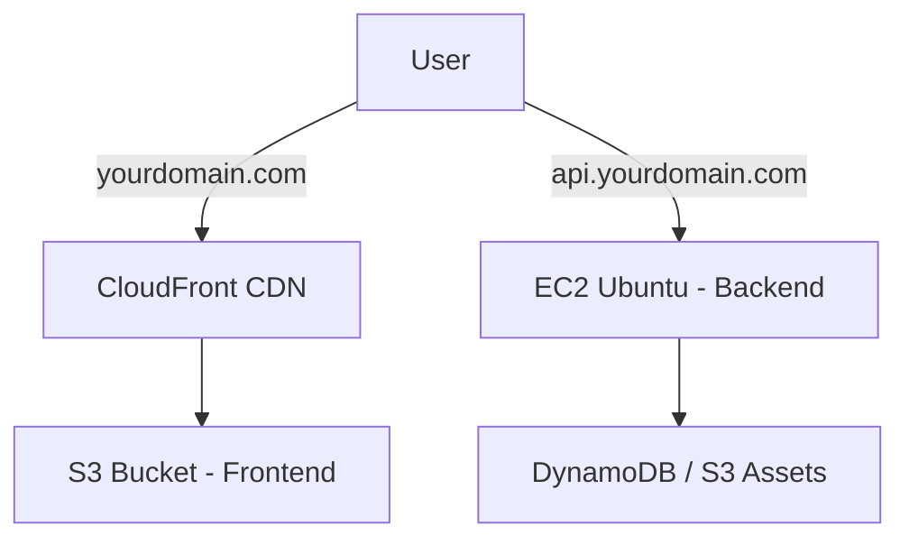

# 🚀 Deployment Guide: AWS Infrastructure

This guide provides step-by-step instructions to deploy your JBC India project using the following architecture:



---

## 🏗️ 1. Frontend Deployment (React + S3 + CloudFront)

### Step 1: Build the Frontend
1. Go to the `client` directory.
2. Update `.env` (or set environment variables in your CI/CD) with:
   `VITE_API_URL=https://api.yourdomain.com/api`
3. Run `npm install` and `npm run build`.
4. This creates a `dist` folder.

### Step 2: S3 Bucket Setup
1. **Create Bucket**: Name it `yourdomain.com` (or similar).
2. **Permissions**: 
   - Disable "Block all public access" (if you want direct S3 access, but CloudFront is better).
   - **Better**: Use CloudFront **Origin Access Control (OAC)** to keep the bucket private.
3. **Properties**: Enable "Static website hosting" if not using CloudFront (but we are).

### Step 3: CloudFront Setup
1. **Create Distribution**:
   - **Origin Domain**: Select your S3 bucket.
   - **Origin Access**: Use **Origin Access Control (OAC)** (Recommended).
   - **Viewer Protocol Policy**: Redirect HTTP to HTTPS.
   - **Default Root Object**: `index.html`.
2. **Error Pages**: Create a custom error response for **403** and **404** to return `/index.html` with status **200** (Essential for React Router).
3. **SSL**: Request a certificate in AWS Certificate Manager (ACM) in **us-east-1** (N. Virginia) for `yourdomain.com`.

### Step 4: Route 53
1. Create an **A Record** for `yourdomain.com`.
2. Select **Alias to CloudFront distribution**.

---

## 🛠️ 2. Backend Deployment (Node.js + EC2 Ubuntu)

### Step 1: Launch EC2 Instance
1. **AMI**: Ubuntu 22.04 LTS.
2. **Instance Type**: t2.micro (Free Tier) or t3.small.
3. **Security Group**:
   - Allow **SSH (22)** from your IP.
   - Allow **HTTP (80)** and **HTTPS (443)** from anywhere.
   - Allow **Custom TCP (5001)** (for the API port).

### Step 2: Server Preparation
SSH into your instance:
```bash
ssh -i "your-key.pem" ubuntu@your-ec2-ip
```
Install Node.js and Nginx:
```bash
sudo apt update
sudo apt install -y nodejs npm nginx
sudo npm install -g pm2
```

### Step 3: Deploy Code
1. Clone your repo: `git clone <repo-url>`
2. Go to `server` folder: `cd jbcindia-clone/server`
3. Install dependencies: `npm install`
4. Create `.env` file and add:
   ```env
   PORT=5001
   FRONTEND_URL=https://yourdomain.com
   AWS_REGION=ap-south-1
   # Add your DynamoDB and Cognito Configs here
   ```
5. Start server with PM2: `pm2 start src/index.js --name jbc-api`

### Step 4: Nginx Reverse Proxy
Edit Nginx config:
```bash
sudo nano /etc/nginx/sites-available/default
```
Replace content with:
```nginx
server {
    listen 80;
    server_name api.yourdomain.com;

    location / {
        proxy_pass http://localhost:5001;
        proxy_http_version 1.1;
        proxy_set_header Upgrade $http_upgrade;
        proxy_set_header Connection 'upgrade';
        proxy_set_header Host $host;
        proxy_cache_bypass $http_upgrade;
    }
}
```
Restart Nginx: `sudo systemctl restart nginx`

### Step 5: SSL (Certbot)
```bash
sudo apt install certbot python3-certbot-nginx
sudo certbot --nginx -d api.yourdomain.com
```

### Step 6: Route 53
1. Create an **A Record** for `api.yourdomain.com`.
2. Point it to your **EC2 Public IP**.

---

## 🔗 3. Final Integration Checklist

1. **CORS**: Ensure the backend `server/src/app.js` allows `https://yourdomain.com`.
2. **Environment Variables**:
   - Frontend `VITE_API_URL` -> `https://api.yourdomain.com/api`
   - Backend `FRONTEND_URL` -> `https://yourdomain.com`
3. **AWS IAM**: Ensure the EC2 instance has an **IAM Role** with permissions for DynamoDB and S3 if you aren't using access keys in `.env`.

---

## 📝 Maintenance Commands
- **Check Logs**: `pm2 logs`
- **Restart Backend**: `pm2 restart jbc-api`
- **Nginx Status**: `sudo systemctl status nginx`
